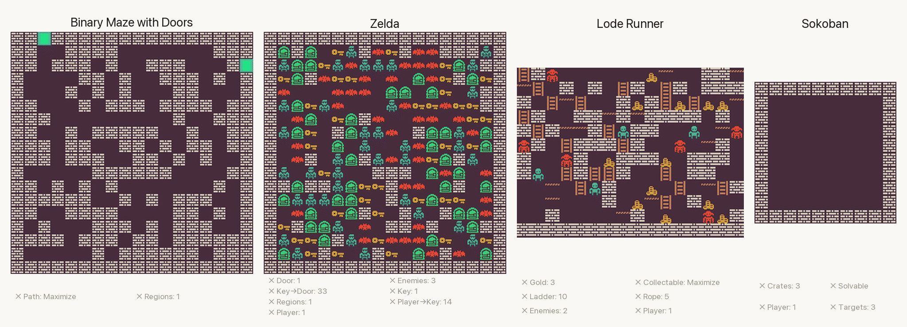
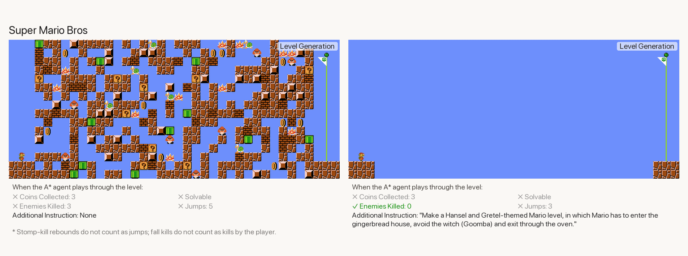

<h1 align="center">Agentic PCG</h1>
<p align="center">
  <a href="https://zehua-jiang.github.io/AgenticPCG/"></a>
</p>

<p align="center">
  
</p>
<p align="center">
  
</p>


LLM agent system that uses structured tool calling to optimize game levels through iterative evaluation and editing. Supports Binary Maze, BinaryDoor, Zelda, Sokoban, LodeRunner, and Super Mario Bros.

## Installation

```bash
git clone --recurse-submodules https://github.com/JiangZehua/AgenticPCG.git
cd AgenticPCG
uv sync   # Python 3.12+
```

## Quick Start

```bash
# Single optimization run
uv run python main.py --config configs/zelda.yaml --seed 42 --max-steps 50

# Debug mode (saves full LLM prompts/responses to debug.log)
uv run python main.py --config configs/zelda.yaml --seed 42 --max-steps 5 --debug

# With target overrides (controllability)
uv run python main.py --config configs/zelda.yaml --target player_key 20 --target key_door 15

# Custom initialization
uv run python main.py --config configs/zelda.yaml --init empty --seed 42 --max-steps 50

# Extra instruction appended to LLM prompt
uv run python main.py --config configs/zelda.yaml --seed 42 --max-steps 50 \
  --extra-instruction "Make the layout look like the letter A"

# Override edit tools (default: auto per problem type)
uv run python main.py --config configs/zelda.yaml --edit-tools place_single_tile place_line place_patch
uv run python main.py --config configs/binary_32.yaml --edit-tools generate_maze generate_ca generate_connect

# Resume from a previous run
uv run python main.py --resume-from runs/20260224_112947_gemini-2.5-pro_binary --max-steps 10
```

### Using Different Providers

```bash
# Portkey (default)
uv run python main.py --config configs/zelda.yaml --seed 42 --max-steps 50

# Local vLLM model
uv run python main.py --config configs/zelda.yaml \
  --provider openai --model Qwen/Qwen3.5-35B-A3B-FP8 \
  --base-url http://localhost:8000/v1 --seed 42 --max-steps 50

# Google Genai
echo "GOOGLE_API_KEY=your-key-here" >> .env
uv run python main.py --config configs/binary_32.yaml \
  --provider google --model gemini-2.5-flash --seed 42 --max-steps 50
```

## Experiments & Sweeps

```bash
# Parallel experiments (quality / controllability / diversity)
uv run python run_experiment.py --config configs/zelda.yaml --experiment quality --num-trials 10 --max-workers 4

# Multi-dimensional sweep (models x problems x tools x inits x ...)
uv run python run_sweep.py --config configs/sweep.yaml
uv run python run_sweep.py --config configs/sweep.yaml --dry-run   # Preview combinations

# Resume interrupted sweep
uv run python run_sweep.py --config configs/sweep.yaml --run-dir runs/{existing_sweep_dir}
```

## Visualization & Analysis

```bash
# Re-render simulation GIF (SMB / Zelda)
uv run python render_simulation.py runs/some_smb_run/

# SMB trajectory PNG (spawn positions, movement paths, kill markers)
uv run python render_trajectory.py runs/some_smb_run/ --scale 3

# Per-tool-call edit animation
uv run python render_per_tool_call_edit.py runs/some_run/
uv run python render_per_tool_call_edit.py runs/some_run/ --all-steps  # Include rejected

# Trace analysis (tool usage, acceptance rates, tile changes)
python analyze_trace.py runs/some_run/
python analyze_trace.py runs/run1/ runs/run2/ runs/run3/  # Multi-run comparison

# Cross-model comparison tables + LaTeX/charts
uv run python regenerate_cross_model_tables.py && uv run python generate_latex_and_charts.py
```

See [docs/visualization.md](docs/visualization.md) for details.


## Configuration

Problem configs live in `configs/`. Each specifies environment dimensions, metric targets (`mode: target` or `mode: maximize`), scoring weights, and controllability ranges.

```
configs/
├── default.yaml      # Binary Maze 16x16
├── binarydoor.yaml   # BinaryDoor 16x16
├── zelda.yaml        # Zelda 16x16
├── sokoban.yaml      # Sokoban 8x8
├── loderunner.yaml   # Lode Runner 11x16
├── smb.yaml          # Super Mario Bros 16x32
└── sweep.yaml        # Sweep config for run_sweep.py
```

See [docs/configuration.md](docs/configuration.md) for edit tools, initialization strategies, acceptance strategies, conversation history, control parameters, and sweep config structure.

## Further Documentation

- [docs/configuration.md](docs/configuration.md) — Configuration reference (tools, init, acceptance, sweeps, control params)
- [docs/cli_reference.md](docs/cli_reference.md) — Full CLI flags for `main.py`, `run_experiment.py`, `run_sweep.py`
- [docs/visualization.md](docs/visualization.md) — Rendering, trajectory, animation, trace analysis, cross-model tables
- [docs/adding_a_new_game.md](docs/adding_a_new_game.md) — Step-by-step guide to adding a new game domain
- [PCG Benchmark](https://github.com/JiangZehua/pcg_benchmark) — The evaluation benchmark (included as a submodule)

## Citation

If you find this work helpful, please cite us. Note: a formal publication is forthcoming --- this BibTeX entry will be updated accordingly.

```bibtex
@misc{jiang_2026_19355469,
  author       = {Jiang, Zehua and
                  Earle, Sam and
                  Khalifa, Ahmed and
                  Togelius, Julian},
  title        = {Agentic PCG: Procedural Content Generation via
                   Tool-using LLMs},
  month        = mar,
  year         = 2026,
  publisher    = {Zenodo},
  doi          = {10.5281/zenodo.19355469},
  url          = {https://doi.org/10.5281/zenodo.19355469},
}
```
